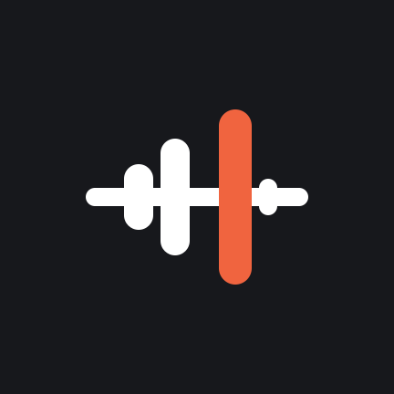
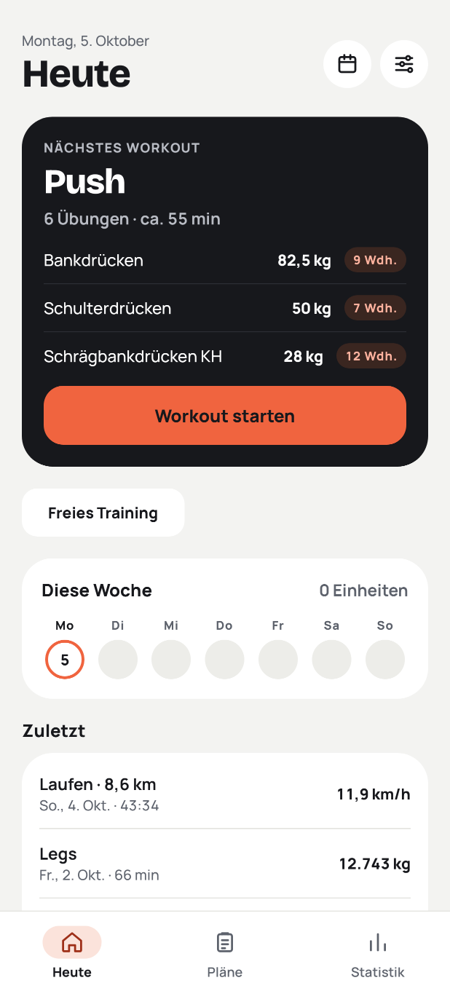
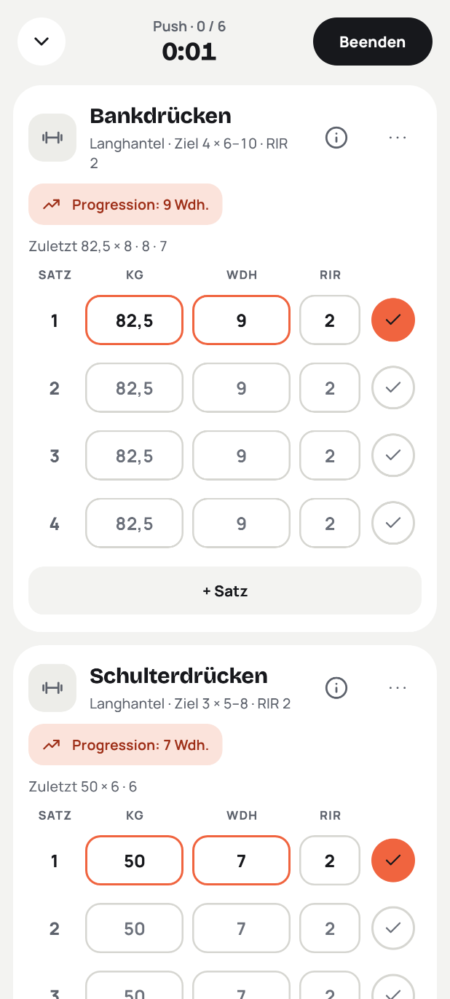
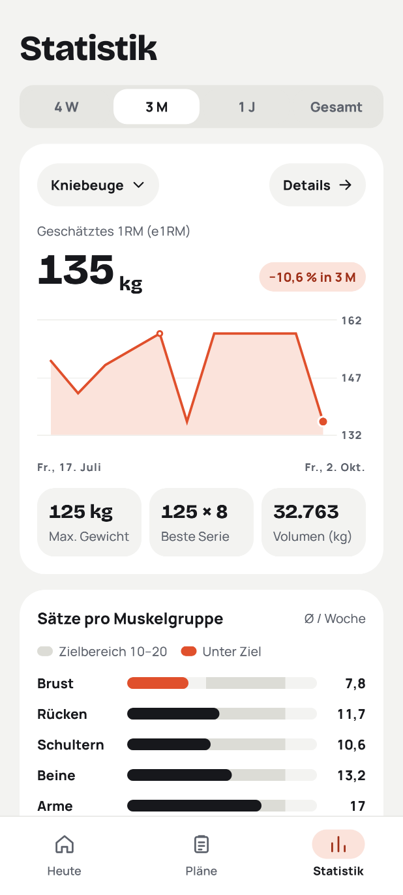
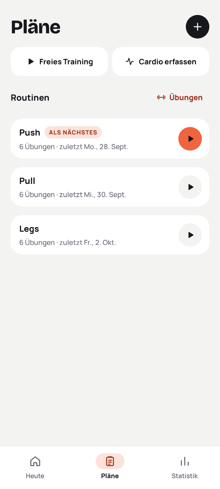
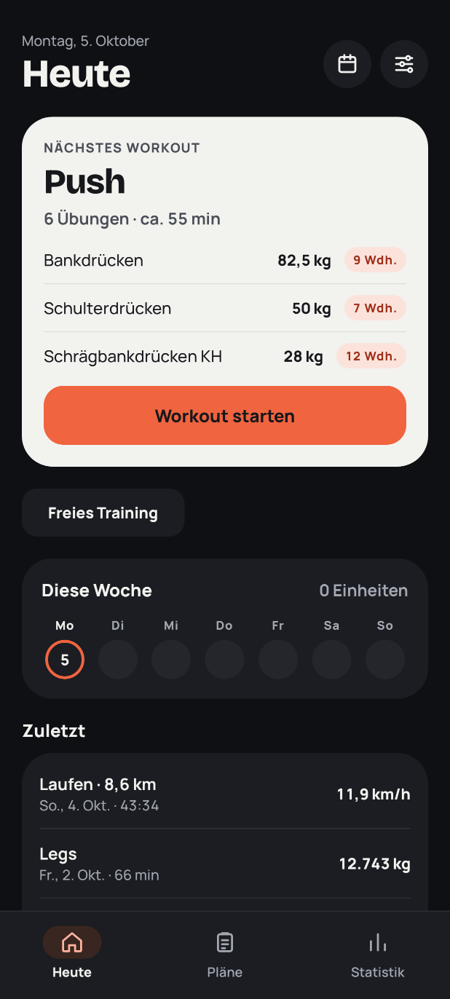
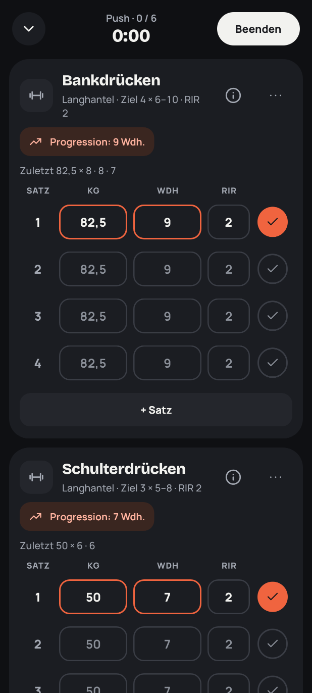

<p align="center">
  
</p>

<h1 align="center">Aximo</h1>

<p align="center">
  Trainings-Tracker für Android: Kraft, Bodyweight und Cardio loggen, Fortschritt sehen,<br>
  Gewichte regelbasiert steigern. Offline, ohne Konto, Daten bleiben auf dem Gerät.
</p>

<p align="center">
  <a href="https://github.com/wtf-jb/aximo/actions"></a>
  
  
  
</p>

<p align="center">
  
  
  
  
</p>

## Inhalt

- [Warum Aximo](#warum-aximo)
- [Funktionen](#funktionen)
- [So läuft ein Training](#so-läuft-ein-training)
- [Datenschutz](#datenschutz)
- [Installation](#installation)
- [Selbst bauen](#selbst-bauen)
- [Projektstruktur](#projektstruktur)
- [Mitmachen](#mitmachen)
- [Lizenz und Danksagung](#lizenz-und-danksagung)

## Warum Aximo

Aximo ist als Ersatz für FitNotes entstanden: dieselbe schnelle Eingabe im Studio, aber mit moderner Oberfläche, besseren Auswertungen und einer Progression, die mitdenkt. Die KI-Funktionen sind optional, mit eigenem API-Key, und machen nur Vorschläge, die du bestätigst.

**Grundsätze**

- **Offline zuerst.** Alles Wesentliche funktioniert ohne Netz.
- **Daten lokal.** Kein Konto, kein Backend, kein Cloud-Sync, kein Tracking.
- **Ein Satz, ein Tipp.** Gewicht und Wiederholungen sind vorbelegt, Abhaken reicht.
- **Vorschlag statt Automatik.** Regeln und KI ändern nie selbst etwas an deinem Plan.
- **F-Droid-tauglich.** Keine Google Play Services, kein Firebase, keine proprietären SDKs.

## Funktionen

### Grundfunktion (ohne KI, offline)

| Bereich | Was es kann |
|---|---|
| Übungen | Eigene Übungen mit Typ, Muskelgruppen, Equipment, Inkrement und Wdh.-Bereich. Katalog mit 668 Übungen (Deutsch/Englisch, Anleitung, Start-/End-Foto) |
| Workout | Sätze mit Gewicht, Wdh. und RIR oder RPE. Satztypen Warm-up, Arbeit, Drop, Failure. Supersätze und Zirkel. Letzte Leistung je Übung sichtbar |
| Rest-Timer | Startet nach jedem abgehakten Satz, Notification mit Countdown, Ton und Vibration am Ende, bei Supersätzen erst nach der Runde |
| Routinen | Push/Pull/Legs o. Ä. mit Zielen je Übung (Sätze, Wdh.-Bereich, Ziel-RIR). Reihenfolge per Drag-and-drop |
| Progression | Double Progression nach jedem Training: oberes Wdh.-Ziel in allen Arbeitssätzen erreicht → nächstes Mal mehr Gewicht. Zweimal klar darunter → Reduktion. Gerundet auf Scheibenschritte |
| Cardio | Laufen, Rad, Rudern und eigene Aktivitäten mit Dauer, Distanz, Puls, Höhenmetern. Pace bzw. Tempo automatisch. Kalorienschätzung für Workouts und Cardio |
| Statistik | e1RM-Verlauf, Bestwerte, Sätze je Muskelgruppe und Woche, Kalender und Heatmap, Streak, Cardio-Trends |
| Daten | Vollexport und Restore als JSON, CSV-Export der Sätze |
| Einstellungen | Deutsch/Englisch, kg/lbs, Hell/Dunkel/System, Standard-Pause und -Inkremente, Wochenziel |

### KI und Komfort (optional)

Mit einem eigenen Provider-Profil (OpenAI-kompatibel, z. B. Ollama im eigenen Netz, Mistral, OpenRouter, oder Anthropic) erscheinen zusätzlich:

- **Wochen-Review:** wöchentliche Auswertung mit konkreten Plan-Änderungen als Diff, jede einzeln übernehmen oder verwerfen
- **Plan erstellen:** Routinen aus Ziel, Tagen, Dauer und Equipment, als Entwurf zum Prüfen
- **Text- und Sprach-Logging:** „Bankdrücken 3x8 80 kg RIR 2“ wird zu Sätzen, mit Vorschau vor dem Speichern
- **Coach-Chat:** Fragen zur eigenen Historie („Warum stagniert mein Bankdrücken?“)

Ohne Profil sind diese Funktionen ausgeblendet; die App bleibt voll nutzbar.

<p align="center">
  
  
</p>

## So läuft ein Training

1. **Heute** zeigt das nächste Workout aus deinen Routinen, mit den Übungen, die sich seit dem letzten Mal ändern (z. B. „82,5 kg · 9 Wdh.“).
2. **Workout starten:** Alle Sätze sind mit Gewicht und Wdh. aus der letzten Einheit plus Progressionsvorschlag vorbelegt. Werte antippen zum Ändern, Haken zum Abschließen.
3. **Pause:** Nach dem Haken läuft der Rest-Timer, auch bei gesperrtem Display (Notification).
4. **Beenden:** Der Abschluss zeigt Dauer, Volumen, neue Bestwerte und was beim nächsten Mal anders ist. Dazu Gefühl (1–5) und eine Notiz.
5. **Nächstes Mal** schlägt Heute automatisch die folgende Routine vor (Push → Pull → Legs → Push …).

## Datenschutz

- Keine Konten, keine Analytics, keine Werbung, keine Crash-Reporter.
- Trainingsdaten liegen in einer lokalen Datenbank; Backups gehen nur dorthin, wohin du sie exportierst.
- Die `INTERNET`-Berechtigung wird nur für die optionalen KI-Funktionen genutzt. An den Provider gehen ausschließlich aggregierte Werte (z. B. Sätze je Muskelgruppe, e1RM-Verläufe), keine Rohdaten. Vor dem ersten Aufruf zeigt die App genau, was gesendet wird.
- API-Keys werden mit dem Android Keystore verschlüsselt.

## Installation

Aximo ist noch nicht in einem Store. Die aktuelle Debug-Version von `main`:

**[aximo-debug.apk herunterladen](https://github.com/wtf-jb/aximo/releases/download/debug-latest/aximo-debug.apk)**

Auf dem Handy öffnen und die Installation aus unbekannten Quellen erlauben. Updates installieren sich über die alte Version, die Daten bleiben. Voraussetzung: Android 9 oder neuer.

Eine F-Droid-Veröffentlichung ist geplant.

## Selbst bauen

Voraussetzungen: JDK 21 und ein Android SDK mit Plattform 37 (`ANDROID_HOME` gesetzt). Gradle kommt über den Wrapper.

```bash
git clone https://github.com/wtf-jb/aximo.git
cd aximo
./gradlew assembleDebug          # APK unter app/build/outputs/apk/debug/
./gradlew test lintDebug         # Unit-Tests und Lint, wie in der CI
./gradlew installDebug           # auf ein verbundenes Gerät (USB oder Wireless Debugging)
```

Die Screenshots in dieser README rendert ein Robolectric-Test aus der echten App mit Beispieldaten, ohne Gerät:

```bash
./gradlew :app:testDebugUnitTest -Pscreenshots --tests '*ReadmeScreenshots*'
```

## Projektstruktur

| Modul | Inhalt |
|---|---|
| `:domain` | Reines Kotlin ohne Android: Modelle, Progression, e1RM, Volumen, Statistik, Kalorien. Vollständig unit-getestet |
| `:data` | Room-Datenbank, Repositories, DataStore, JSON-/CSV-Export, Übungskatalog |
| `:ai` | Provider-Adapter (OpenAI-kompatibel, Anthropic) über Ktor, Prompt- und Antwort-Parser |
| `:app` | Jetpack-Compose-UI (Material 3), ViewModels, Navigation, Koin, Rest-Timer-Service, WorkManager |

Stack: Kotlin, Jetpack Compose, Material 3, MVVM mit StateFlow, Room, Koin, Navigation Compose, kotlinx.serialization, kotlinx-datetime, DataStore, Vico, WorkManager, Ktor.

Dokumentation:

- [`docs/requirements.md`](docs/requirements.md): Anforderungen (A-01 … C-03), Datenmodell, Architektur
- [`docs/design/`](docs/design): Design-System, Tokens, Mockups je Screen
- [`docs/decisions.md`](docs/decisions.md): alle Entscheidungen mit Begründung
- [`docs/progress.md`](docs/progress.md): Stand, nächste Schritte

## Mitmachen

Aximo ist ein persönliches Projekt, Issues und Vorschläge sind trotzdem willkommen. Für Code gilt:

- Design nur über Tokens (`MaterialTheme`, `ExtendedColors`, `Spacing`, `Sizes`), keine festen Farben oder dp-Werte in Composables.
- Keine hartcodierten UI-Texte; Strings in `values` (EN) und `values-de` (DE).
- Domain-Logik mit Unit-Tests; `./gradlew test assembleDebug lintDebug` muss grün sein.
- Keine Abhängigkeiten, die F-Droid ausschließen.

Details stehen in [`CLAUDE.md`](CLAUDE.md) und [`docs/design/design-system.md`](docs/design/design-system.md).

## Lizenz und Danksagung

Lizenz: GPLv3 vorgesehen (Arbeitsannahme, siehe `docs/decisions.md`); die `LICENSE`-Datei folgt vor der ersten Veröffentlichung.

- Schriften: [Bricolage Grotesque](https://github.com/ateliertriay/bricolage) und [Manrope](https://github.com/sharanda/manrope), beide unter der SIL Open Font License ([`licenses/`](licenses))
- Übungskatalog und Fotos: [free-exercise-db](https://github.com/yuhonas/free-exercise-db) (Unlicense)
- Icons nach [Lucide](https://lucide.dev) (ISC)
